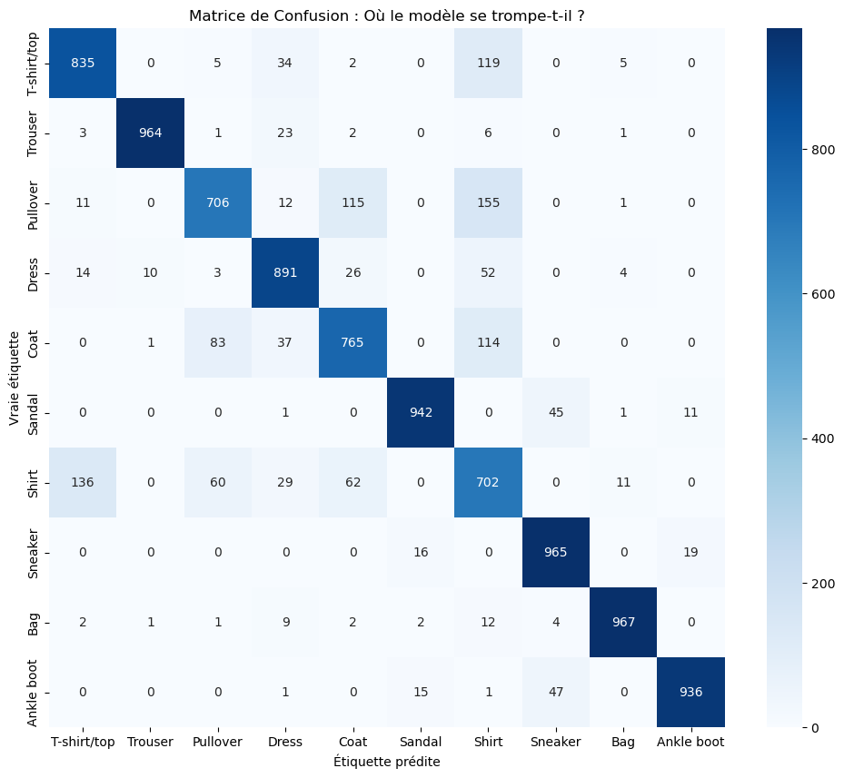
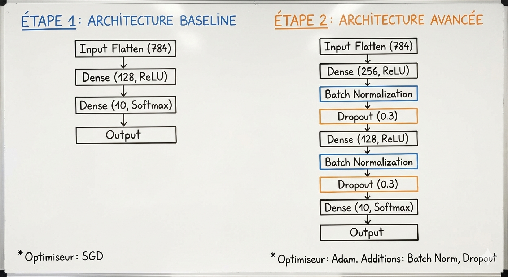

# Fashion-MNIST Classification Benchmark

## À propos du projet
Ce projet est une étude de cas réalisée dans le cadre du cours **"Advanced Machine Learning"** à **Junia_ISEN**.

L'objectif était de pousser les limites des architectures **MLP (Multi-Layer Perceptron)** sur le dataset **Fashion-MNIST** (classification de vêtements) pour comprendre où se situe le "plafond de verre" des réseaux denses par rapport aux réseaux convolutifs (CNN).

## L'Expérience
Nous avons comparé deux architectures :
1.  **Baseline Model :** Un MLP standard avec optimiseur SGD.
2.  **Advanced Model :** Un MLP optimisé avec **Adam**, **Batch Normalization** et **Dropout**.

## Résultats Clés

### 1. Performance d'entraînement
Le modèle avancé converge plus vite et évite le surapprentissage (overfitting) visible sur la baseline.

### 2. Analyse des erreurs
Le modèle atteint **~88% de précision**. La matrice de confusion révèle qu'il "hésite" sur les textures proches :
* **T-shirts vs Chemises**
* **Pulls vs Manteaux**

##  Architecture du Modèle
Pour améliorer la généralisation, le modèle avancé utilise la structure suivante :

## Auteur
**Ramcy Said FOM** - Étudiant à Junia_ISEN
