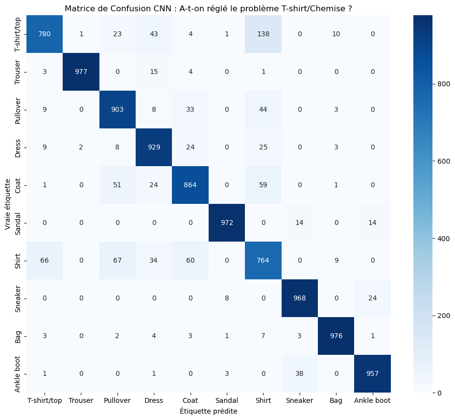

# 👔 Fashion-MNIST Classification Benchmark

## 📖 À propos du projet
Ce projet est une étude de cas réalisée dans le cadre du cours **"Advanced Machine Learning"** à **Junia_ISEN**.

L'objectif était de comparer les limites des architectures denses (**MLP**) face à la puissance d'extraction spatiale des réseaux convolutifs (**CNN**) sur le dataset **Fashion-MNIST**.

---

## 🧪 Partie 1 : L'approche MLP (Multi-Layer Perceptron)
Nous avons d'abord testé un réseau dense classique, puis optimisé (Adam, Batch Normalization, Dropout).

* **Précision maximale :** ~88%
* **Le "Plafond de verre" :** En aplatissant l'image en 1D (Flatten), le MLP perd la structure spatiale. La matrice de confusion a révélé une forte hésitation sur les textures visuellement proches (ex : plus de 110 T-shirts confondus avec des Chemises).

---

## 🚀 Partie 2 : L'approche CNN (Convolutional Neural Network)
Pour résoudre ce problème, nous avons implémenté une architecture convolutive (Inspirée de LeNet) permettant de conserver l'image en 2D et d'extraire des "features" (bords, cols, manches).

* **Nouvelle Précision :** **~91%** (+3% d'amélioration nette).
* **Résultat :** Le modèle différencie désormais beaucoup mieux les T-shirts des Chemises grâce à la détection spatiale des formes.

**Matrice de Confusion du CNN :**
 *(<-- Assure-toi que ce nom correspond à l'image que tu viens d'enregistrer)*

---

## 🛠️ Architecture CNN Utilisée
1. **Extraction de caractéristiques (Features Learning) :**
   - Conv2D (32 filtres, 3x3) + MaxPooling (2x2)
   - Conv2D (64 filtres, 3x3) + MaxPooling (2x2)
   - Conv2D (64 filtres, 3x3)
2. **Classification :**
   - Flatten -> Dense (64, ReLU) -> Dense (10, Softmax)

## 👤 Auteur
**Ton Prénom NOM** - Étudiant à Junia_ISEN