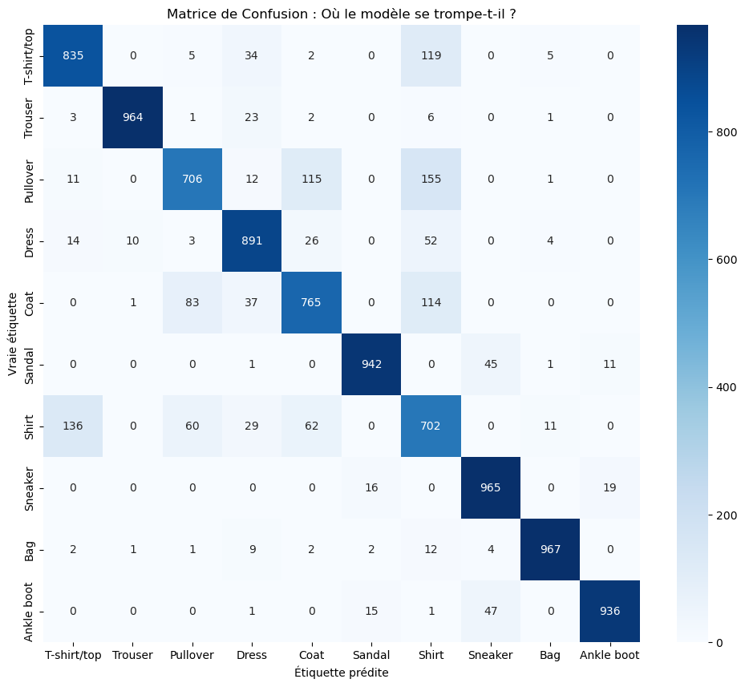
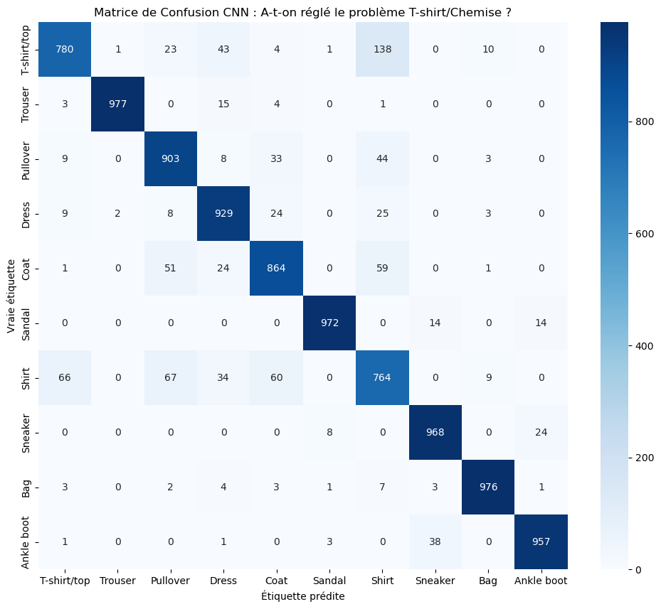

# Fashion-MNIST — apprendre à un programme à reconnaître des vêtements sur une photo


Ce projet sert à **comparer plusieurs façons d'apprendre à un ordinateur à reconnaître le type d'un vêtement** (t-shirt, pantalon, basket, sac…) à partir d'une petite image en noir et blanc.

Projet réalisé dans le cadre du cours **« Advanced Machine Learning »** à **Junia ISEN**.

---

## À quoi ça sert

Reconnaître un vêtement sur une photo est facile pour nous, mais pas pour un ordinateur : pour lui, une image n'est qu'un tableau de nombres (l'intensité de chaque point). On ne peut pas lui écrire des règles du type « s'il y a deux manches, c'est un pull ».

À la place, on lui montre des milliers d'exemples déjà étiquetés, et il apprend seul à faire le lien entre l'image et la catégorie. C'est le principe de l'**apprentissage automatique** (*machine learning*).

Ce projet est un exercice de comparaison : on construit trois programmes de plus en plus élaborés, on mesure leur taux de bonnes réponses et on regarde **sur quels vêtements ils se trompent**.

---

## Comment ça marche

### Les données

On utilise **Fashion-MNIST**, un **dataset** (jeu de données) public très utilisé pour s'exercer :

- 60 000 images pour l'**entraînement** (les exemples dont le programme apprend) ;
- 10 000 images pour le **test** (des images jamais vues pendant l'apprentissage, pour mesurer le résultat) ;
- chaque image fait 28 × 28 points, en niveaux de gris ;
- 10 catégories : T-shirt/haut, pantalon, pull, robe, manteau, sandale, chemise, basket, sac, bottine.

### Les modèles

Un **modèle** est ici un **réseau de neurones** : une fonction mathématique composée de nombreuses petites unités de calcul (les « neurones ») organisées en couches. Chaque neurone possède des réglages, que l'entraînement ajuste petit à petit pour réduire le nombre d'erreurs.

Trois modèles sont comparés :

1. **Modèle de base** (*baseline*) — un **MLP** (*Multi-Layer Perceptron*, « perceptron multicouche »), le réseau le plus simple : l'image est d'abord **aplatie** en une longue ligne de 784 nombres, puis passe par une couche de 128 neurones.
2. **MLP amélioré** — même principe, avec plus de neurones (256 puis 128) et deux techniques pour mieux apprendre :
   - la **normalisation par lot** (*Batch Normalization*), qui stabilise les calculs pendant l'entraînement ;
   - le **dropout**, qui désactive au hasard 30 % des neurones à chaque étape, pour éviter que le modèle apprenne les exemples par cœur au lieu de comprendre (ce qu'on appelle le **surapprentissage**).
3. **CNN** (*Convolutional Neural Network*, « réseau de neurones convolutif ») — un réseau conçu pour les images. Au lieu d'aplatir l'image, il la parcourt avec de petites fenêtres de 3 × 3 points (des **filtres**) qui repèrent des motifs locaux : bords, contours, formes. C'est un peu comme examiner un vêtement à la loupe, zone par zone, plutôt que de lire tous ses points à la suite.

Chaque modèle est entraîné pendant 10 **époques** (une époque = un passage complet sur les 60 000 images d'entraînement).

### Comment on mesure le résultat

- **Précision** (*accuracy*) : le pourcentage d'images de test correctement classées.
- **Matrice de confusion** : un tableau qui croise la vraie catégorie (en ligne) et la catégorie prédite (en colonne). La diagonale contient les bonnes réponses ; les autres cases montrent quelles catégories sont confondues entre elles.

---

## Résultat / ce qu'on obtient

Précision sur les 10 000 images de test, d'après les sorties enregistrées dans le notebook `Mini_projet_AML.ipynb` :

| Modèle | Précision sur le test |
|---|---|
| MLP de base (SGD) | 85,81 % |
| MLP amélioré (Adam, Batch Normalization, Dropout) | 86,36 % |
| CNN | **90,90 %** |

Le CNN gagne environ **4,5 points** par rapport au meilleur MLP.

### Où les modèles se trompent

Les confusions les plus fréquentes concernent des vêtements de forme proche : **T-shirt / chemise**, **pull / manteau / chemise**, **basket / bottine / sandale**.



*Matrice de confusion d'une exécution du MLP amélioré (`image/output.png`). Sa diagonale donne 86,73 % de bonnes réponses : elle provient d'une autre exécution que celle enregistrée dans le notebook (86,36 %).*



*Matrice de confusion du CNN (`image/cnn_confusion_matrix.png`, 90,90 % de bonnes réponses).*

En comparant ces deux images :

- les **chemises prises pour des T-shirts** passent de 136 à 66 ;
- les **pulls** bien reconnus passent de 706 à 903 sur 1 000, et les **manteaux** de 765 à 864 ;
- en revanche, les **T-shirts pris pour des chemises** passent de 119 à 138 : la confusion T-shirt / chemise diminue au total (255 → 204 erreurs) mais ne disparaît pas.

### Autres images

- `image/Image_e46dvde46dvde46d.png` : schéma des architectures du MLP de base et du MLP amélioré.
- `image/Capture d’écran 2026-01-21 023108.png` : courbes de précision dans TensorBoard (outil qui trace l'évolution de l'entraînement) pour le MLP de base et le MLP amélioré.

---

## Pour les développeurs

### Contenu du notebook (`Mini_projet_AML.ipynb`)

1. **Modèle baseline** — chargement de Fashion-MNIST via `keras.datasets`, normalisation des pixels (division par 255), encodage *one-hot* des étiquettes, MLP `Flatten → Dense(128, ReLU) → Dense(10, Softmax)`, optimiseur SGD, 10 époques, `batch_size=32`.
2. **Modèle avancé** — `Flatten → Dense(256, ReLU) → BatchNorm → Dropout(0.3) → Dense(128, ReLU) → BatchNorm → Dropout(0.3) → Dense(10, Softmax)`, optimiseur Adam, 10 époques, `batch_size=32`.
3. **Matrice de confusion** du modèle avancé (`sklearn.metrics.confusion_matrix` + `seaborn.heatmap`).
4. **Partie 2 : CNN** (inspiré de LeNet), optimiseur Adam, 10 époques, `batch_size` par défaut (32) :
   - extraction de caractéristiques : `Conv2D(32, 3×3, ReLU) → MaxPooling(2×2) → Conv2D(64, 3×3, ReLU) → MaxPooling(2×2) → Conv2D(64, 3×3, ReLU)` ;
   - classification : `Flatten → Dense(64, ReLU) → Dense(10, Softmax)`.
5. **Matrice de confusion** du CNN.

Fonction de perte : `categorical_crossentropy` pour les trois modèles.

### Installation

```bash
pip install tensorflow numpy matplotlib seaborn scikit-learn jupyter
```

Le notebook a été exécuté avec Keras 3 (intégré à TensorFlow 2.16 et plus).

### Exécution

```bash
jupyter notebook Mini_projet_AML.ipynb
```

Les cellules d'entraînement des deux MLP écrivent des journaux TensorBoard dans un dossier écrit en dur (`C:\Users\...\Documents\tensorboard`). Adaptez la variable `log_dir` à votre machine avant d'exécuter, puis visualisez avec :

```bash
tensorboard --logdir <votre_dossier_de_logs>
```

### Structure du projet

```
Fashion_MNIST_Project/
├── Mini_projet_AML.ipynb     # Notebook complet (MLP, MLP amélioré, CNN)
├── image/
│   ├── output.png                         # Matrice de confusion du MLP amélioré
│   ├── cnn_confusion_matrix.png           # Matrice de confusion du CNN
│   ├── Image_e46dvde46dvde46d.png         # Schéma des architectures MLP
│   └── Capture d’écran 2026-01-21 023108.png  # Courbes TensorBoard
├── LICENSE                   # MIT
└── README.md
```

### Technologies

| Rôle | Outil |
|---|---|
| Réseaux de neurones | TensorFlow / Keras |
| Calcul | NumPy |
| Matrice de confusion | scikit-learn |
| Graphiques | Matplotlib, Seaborn |
| Suivi de l'entraînement | TensorBoard |

---

## Auteur

**Ramcy-cloud** — étudiant à Junia ISEN
